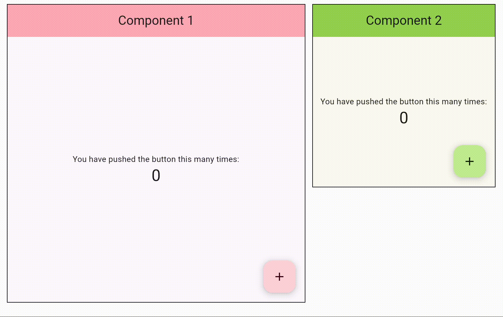

# PoC: Two Flutter apps in the same document

This project illustrates how to run two independent Flutter Apps in the same HTML document. Dart's JS bridge is used to share states and events between them.

## Requirements

* Install flutter and switch to the master channel:

    ```bash
    flutter channel master
    flutter upgrade
    ```

* Install docker in order to run the web servers

## How to run the demo

1. Build component 1:

    ```bash
    cd component1
    flutter build web
    ```

2. Build component 2

    ```bash
    cd component2
    flutter build web
    ```

3. start the servers:

    ```bash
    ./startServers.sh
    ```

Browse to <http://localhost:8080> to see both the component1 App (pink) and component 2 (green) rendered in two different divs.

## How it works

Support to render a Flutter App in a custom HTML node (instead of redefining the whole body) is expected to arrive in a future release, but it's already in the master channel.

Using this capability, a [JS script](component1/web/js/interop.js) keeps a list of the components to render, with a logical name and a URL for each one.

When the page is loaded the script uses the Flutter loader to fetch and run the flutter projects, expecting a div with the appropriate id for each one.

In the demo, the position and size of the containers are defined in pure CSS.

The same script does the binding of state and events following a naming convention (see [component1/web/js/interop.js](component1/web/js/interop.js))

Both components implement the same App, with different colors. When the apps are running on the same page, they both manage their states and listen for external events. As a consequence, clicking on a button in one of them updates the state on the other too, thanks to the JS binding.


